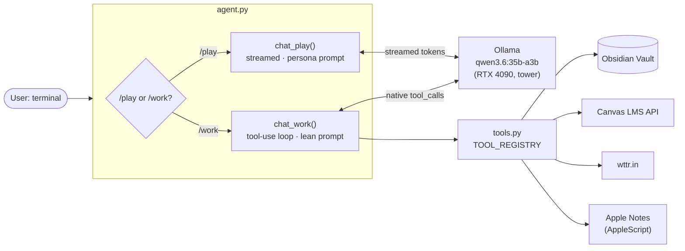

# Tort Agent

> Local LLM agent with a two-mode interface — persona chat **and** tool-using study assistant — running on `qwen3.6:35b-a3b` via Ollama on the homelab tower (RTX 4090). No cloud LLMs, no SaaS dependencies.

---

## Why

Most AI study assistants are wrappers around frontier APIs. Three problems with that:

1. **Cost** — every query bills.
2. **Privacy** — coursework, notes, schedule data, Canvas tokens all leave the device.
3. **Latency on routine work** — I don't need GPT-class reasoning to OCR a PDF or summarize my own notes.

Tort Agent runs entirely on hardware I own. Cloud models are reserved for the hard reasoning work they're actually worth paying for.

---

## Architecture



Two modes share the same model and history but use different system prompts:

| Mode | Prompt | Streaming | Tool calls | Use for |
|---|---|---|---|---|
| `/play` | The Arbiter Mentis (noir / Socratic / Stoic) | ✅ | ❌ | Conversation, philosophy, tutoring |
| `/work` | Lean study-assistant prompt | ❌ (batch) | ✅ | Anything that needs a tool |

The two-mode split came from a practical observation: streaming + tool-calling don't play nicely together when you also want to strip `<think>` blocks for display. Splitting the modes keeps each one robust and lets `/play` push the persona hard without compromising tool reliability in `/work`.

---

## Tools (`/work` mode)

| Tool | Purpose |
|---|---|
| `morning_brief` | Today's weather (configurable city) + Canvas assignments due today/tomorrow + per-class refresher paragraph generated from the most recent note in each course folder. |
| `export_apple_notes` | AppleScript wrapper over Notes.app — exports a folder of handwritten notes to PDFs in an iCloud staging dir. Run before `convert_notes`. |
| `convert_notes` | OCR pipeline: PyMuPDF rasterizes each PDF page → ocrmac (Apple Vision) extracts text → Ollama cleans the OCR into Obsidian-flavored markdown with `[[wikilinks]]` → writes to `03-courses/{course}/`. |
| `develop_concepts` | Reads a lecture note → extracts 3–7 atomic concepts as JSON → writes one file per concept to `01-concepts/` with proper frontmatter (date, domain tag, source tag, related links) → backlinks the source note. Dedupes against existing concepts. |
| `weekly_summary` | Scans `01-concepts/` for files modified in the last 7 days with the matching `source/{course}` tag → asks the model to write a connected weekly summary → drops it in `05-logs/`. |
| `list_directory` | Vault navigation primitive — lets the agent decide what to read next. |

All tools follow the same shape: read environment, call API or filesystem, ask Ollama to format/clean if needed, return a string the agent can show or chain into a follow-up call.

---

## How `/work` mode actually works

The tool-use loop in `agent.py` does the unglamorous bookkeeping that separates "demo agent" from "agent that doesn't lie about what it did":

- **Hard cap on iterations** (`MAX_TOOL_ITERATIONS = 5`) so a model that gets stuck calling the same tool can't burn unlimited compute.
- **JSON-string argument coercion** — Ollama sometimes returns tool args as a JSON string, sometimes as a dict. Both shapes are handled.
- **Working-copy message list** for the tool exchanges so intermediate calls don't pollute long-term conversation history.
- **`<think>` block stripping** for display in `/play` mode — including a careful streaming buffer that doesn't false-trigger on `<` characters in code or HTML (an early bug).
- **Connection / timeout error handling** that pops the user message back off history instead of leaving it dangling on a failed turn.

---

## Setup

```bash
git clone https://github.com/Cap-Dylan/tort-agent.git
cd tort-agent

python3 -m venv venv && source venv/bin/activate
pip install -r requirements.txt

cp .env.example .env
# Fill in CANVAS_API_TOKEN, CANVAS_BASE_URL, OBSIDIAN_VAULT, OLLAMA_URL,
# and OLLAMA_MODEL in .env

# Make sure Ollama is running on whatever host you pointed OLLAMA_URL at:
#   ollama serve
#   ollama pull qwen3.6:35b-a3b   # or whichever model you set

python3 agent.py
```

REPL commands:
```
/work    switch to tool-using mode
/play    switch to persona mode (default)
/tools   list available tools
/think   show reasoning on next message (play mode)
/clear   reset conversation
/model   show current model + endpoint + mode
/help    list all commands
/quit    exit
```

---

## Status

- ✅ **Phase 1** — all six tool implementations
- ✅ **Phase 2** — tool-use loop, mode toggle, structured-output parsing, error handling
- 🚧 **Phase 3** — eval harness for tool-call accuracy across model variants (in progress)
- 📋 **Phase 4** — surface the agent through a macOS Shortcut so it's invokable from anywhere on the system

---

## Hardware

Designed for tower deployment:

- **Tower** — Custom build with RTX 4090 (24GB), 128GB DDR5, runs `qwen3.6:35b-a3b` via Ollama
- **Client** — any machine on the same Tailscale mesh; agent talks to `http://tower.<tailnet>.ts.net:11434`

The agent is host-agnostic — set `OLLAMA_URL` and `OLLAMA_MODEL` in `.env` and it'll work against any Ollama instance with any tool-calling-capable model.

---

## License

MIT — see [LICENSE](LICENSE).
